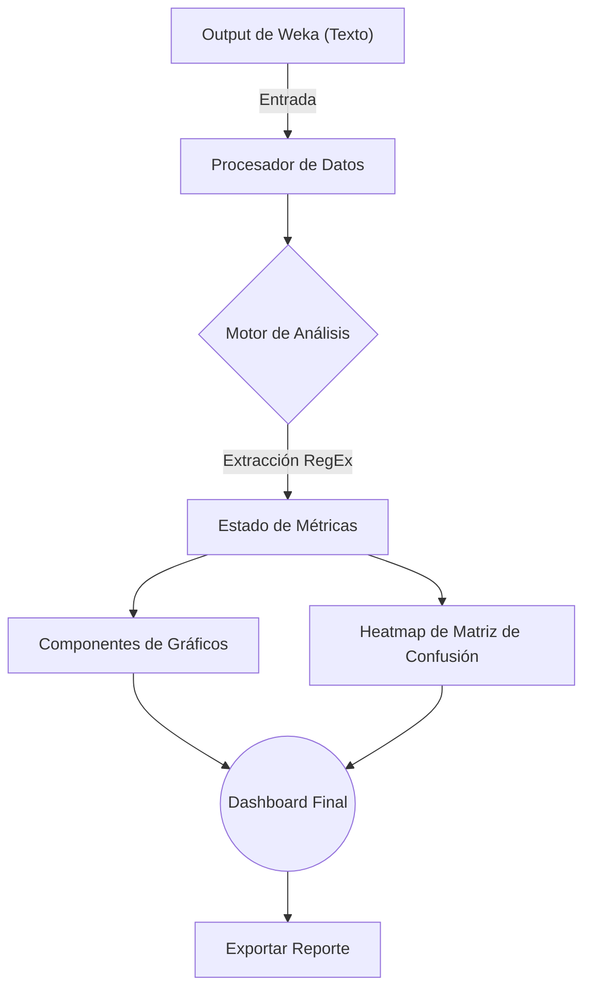

# 📊 Weka Visualizer: Advanced ML Analysis & Dashboard

**Weka Visualizer** es una herramienta de visualización reactiva diseñada para facilitar la interpretación de reportes generados por **Weka Machine Learning**. Convierte los outputs de texto plano en dashboards interactivos y visuales, proporcionando un análisis profundo y eficiente del rendimiento de modelos predictivos.

---

## 🧐 Propósito del Proyecto

El objetivo principal de esta aplicación es servir como una capa de visualización para los resultados de minería de datos obtenidos en Weka. Al procesar el texto del `Classifier Output`, el visualizador extrae métricas críticas y genera representaciones gráficas que permiten identificar rápidamente fortalezas y debilidades en los modelos de clasificación.

---

## ✨ Características Técnicas

*   **⚡ Motor de Parsing Basado en RegEx**: Algoritmo optimizado para extraer automáticamente métricas y estructuras de datos desde el output estándar de Weka (incluyendo soporte para `InputMappedClassifier`).
*   **🔥 Matriz de Confusión Interactiva**: Mapa de calor (Heatmap) que permite identificar visualmente errores de clasificación y sesgos en el modelo.
*   **📈 Visualización de Métricas de Rendimiento**: Dashboards dinámicos para métricas de clasificación: *Precision*, *Recall*, *F-Measure*, *MCC*, *ROC Area* y *PRC Area*.
*   **🔄 Análisis de Overfitting**: Herramientas integradas para comparar resultados entre conjuntos de entrenamiento y prueba.
*   **📂 Exportación de Datos**: Capacidad para exportar análisis detallados a formato Excel y capturar visualizaciones para reportes académicos o técnicos.

---

## 🛠️ Stack Tecnológico

La aplicación ha sido desarrollada utilizando tecnologías modernas para garantizar un rendimiento óptimo y una experiencia de usuario fluida:

*   **Frontend**: [React 18](https://react.dev/) + [Vite](https://vitejs.dev/)
*   **Lenguaje**: [TypeScript](https://www.typescriptlang.org/) (Tipado estricto)
*   **Visualización de Datos**: [Recharts](https://recharts.org/)
*   **Estilos**: [Tailwind CSS 4.0](https://tailwindcss.com/)
*   **Iconografía**: [Lucide React](https://lucide.dev/)

---

## 📐 Flujo de Procesamiento



---

## 🚀 Guía de Instalación y Uso

### Requisitos
- [Bun](https://bun.sh/) o Node.js v18+.

### Instalación de Dependencias
```bash
bun install
```

### Ejecución
```bash
npm run dev
```

---

> [!TIP]
> Para asegurar un parsing correcto, asegúrate de copiar el bloque completo del `Classifier Output` de Weka, incluyendo las secciones de `Detailed Accuracy By Class` y `Confusion Matrix`.

---

© 2026 Weka Visualizer - Proyecto Escolar.